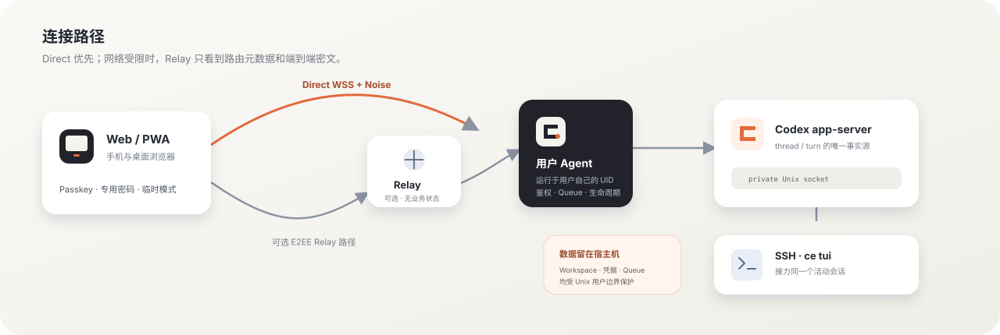

<p align="center">
  
</p>

<h1 align="center">CodexEverywhere</h1>

<p align="center">
  <strong>在手机或桌面浏览器中，安全地继续运行在 Linux / HPC 上的 Codex。</strong><br />
  <sub>Self-hosted Codex Web/PWA for Linux and HPC.</sub>
</p>

<p align="center">
  <a href="https://github.com/JunpoYu/CodexEverywhere/actions/workflows/ci.yml"></a>
  <a href="https://github.com/JunpoYu/CodexEverywhere/releases"></a>
  <a href="LICENSE"></a>
  
</p>

<p align="center">
  <a href="#为什么选择-codexeverywhere">为什么</a> ·
  <a href="#核心体验">功能</a> ·
  <a href="#快速开始">快速开始</a> ·
  <a href="#工作方式">架构</a> ·
  <a href="docs/deployment.zh-CN.md">部署</a> ·
  <a href="CONTRIBUTING.md">贡献</a>
</p>

CodexEverywhere 是一个面向 Linux/HPC 的自托管 Codex Web/PWA 控制平台。它让你离开 SSH 后，仍可从浏览器查看活动会话、发送消息、处理审批、管理工作区，并在 Web 与官方 Codex TUI 之间继续同一个任务。

它不重新实现 Codex Agent。thread、turn、工具调用和执行状态仍以官方 [Codex app-server](https://developers.openai.com/codex/app-server) 为唯一事实源；CodexEverywhere 只补上安全连接、移动端体验、持久 Queue 和 HPC 运行层。

> [!WARNING]
> CodexEverywhere 目前处于 Alpha 阶段，最新预发布版本为 `v0.3.0-alpha.11`。协议、配置和存储结构仍可能变化，现阶段建议用于个人环境或可信团队试用。生产部署请只使用经过 CI 验证的 [GitHub Release](https://github.com/JunpoYu/CodexEverywhere/releases) 制品。

> [!NOTE]
> 这是一个独立的非官方开源项目，与 OpenAI 没有关联或背书。Codex 是 OpenAI 的产品。

## 为什么选择 CodexEverywhere

Codex CLI 很适合终端，但远程 Linux 与 HPC 用户经常还需要一个随时可访问的控制面：

| 使用场景                | CodexEverywhere 提供                                       |
| ----------------------- | ---------------------------------------------------------- |
| 离开 SSH 后任务仍在运行 | 从手机或桌面浏览器继续查看同一个 thread，不中断活动 turn   |
| 需要在移动端处理阻塞    | 固定在输入区附近的审批、用户问答、停止与 Queue 操作        |
| HPC 无法开放入站端口    | Direct 优先；不可达时通过可选 Relay 转发 Noise 端到端密文  |
| 多位成员共用一台宿主机  | 每人使用自己的 Unix UID、`~/.codex` 和 ChatGPT/Codex 账号  |
| Web 与终端来回切换      | `ce tui` 与 Web 接入同一个 app-server，会话和权限保持一致  |
| 老旧集群缺少 systemd    | 兼容 CentOS 7、Node.js 20、tmux、crontab、PID 文件和文件锁 |

CodexEverywhere **不是 Web Terminal**，也不替代 SSH、Slurm、Codex CLI 或集群已有的权限与调度体系。

## 核心体验

### 随时继续真实 Codex 会话

- 创建、恢复和实时查看 app-server thread；支持 Markdown、KaTeX、代码、计划、命令、文件修改、MCP、subagent 和错误卡片。
- 长会话默认只渲染最近 20 个 turn；更早历史按需分页，流式内容与后台 snapshot 按稳定身份合并，旧协议的完整响应也不会绕过默认窗口。
- 只在用户停留于底部时自动跟随；桌面大纲和移动端抽屉帮助快速定位历史消息。
- 在输入框首部键入 `/` 可补全 `/side <问题>`，并基于当前上下文开启真正的 Codex ephemeral fork；只有位于输入首部且带 `/` 的完整命令才会触发 Side。Web 会先通过 Noise 加密握手确认 Agent 支持有界 Side 协议，并在断线重试前再次确认能力，再用独立的 Side 标识和返回入口隔离临时支线；Agent 只返回版本化的继承边界与不透明 app-server 实例代次，不把完整父历史再次传给浏览器，并在协议入口拒绝向 Side 写入持久 Queue。创建连接中断时 Web 保留原幂等键继续确认，并在返回缓存结果前验证临时 thread 仍存在；同宿主机重新认证或静默重连会恢复 Side 视图，暂时读取失败不会丢弃 Side，只有实例代次明确变化才判定它已随 app-server 重启消失并安全返回主会话。此时待确认发送仍在父会话显示为人工核对项，不会变成不可访问的后台记录。Side 内仍有待确认消息时禁止主动离开。它不进入会话列表，刷新、app-server 重启或主动离开后不可恢复，回复也不会自动合并回主会话。
- Codex app-server 当前不允许对 ephemeral thread 使用 `includeTurns`、`thread/turns/list`，并可能因为没有磁盘 rollout 拒绝 `thread/resume`。因此 Agent 会让持有 Side 的页面认证票据继续持有原 app-server 客户端：有效 silent resume 会在旧 WebSocket 报告 close 之前先夺取事件所有权，Side 的实时订阅不断开，空窗期事件由 Agent 有界缓存并在新握手后按序交付。Web 正常刷新或关闭时显式释放该页面票据；纯网络断线或页面进入后台不会释放或增加时间 TTL。Web 仍只用 `thread/read(includeTurns:false)` 核对状态，并以当前页面已经收到的有界 fork/完成事件快照恢复视图；不会用空 read 覆盖已有内容，也不会把 `no rollout found` 误判为 Side 已消失。若页面票据、Agent 或 app-server 本身已经失效，则无法补回此前未收到的 ephemeral 历史。

### 移动端优先的审批与 Queue

- 命令、文件、权限审批和 `requestUserInput` 固定显示在输入框上方，不会被回复刷走。
- thread 忙碌时，消息进入宿主机持久 Queue；队首消息可转为 Steer，结果未知时失败关闭并要求人工核对。
- 发送、审批和设置 mutation 使用稳定幂等键或 durable claim，连接中断后不会盲目重复副作用。

### Web / TUI 无缝接力

- Web、后台 Queue 和 `ce tui` 连接同一个长期 app-server；关闭任一客户端不会停止活动 turn。
- 会话 sandbox 与审批策略按 thread 保存，Agent 或 app-server 重启后不会回落为启动默认值。
- 直接使用原始 `codex --remote` socket 会绕过 CodexEverywhere 的权限协调；需要一致性保证时请使用 `ce tui`。

### 自托管身份与 Unix 隔离

- Passkey 与独立 CodexEverywhere 密码均在宿主机验证；项目不收集、复用或验证 SSH/Linux 密码。
- 每位用户拥有独立 Agent、app-server、Codex 凭据、workspace、thread 和 Queue。
- 管理员控制面只能管理安装、Web 生命周期和凭据恢复，不能读取用户会话、文件或 Codex 身份。

## 工作方式



1. 浏览器优先通过 HTTPS/WSS Direct Gateway 连接用户自己的 Agent。
2. Direct 不可达时，可选 Relay 仅转发 Noise 端到端密文；业务数据仍留在 Codex 宿主机。
3. Agent 通过私有 Unix socket 连接该用户唯一的长期 Codex app-server；`ce tui` 接入同一个事实源。

Relay 会看到连接所需的控制面元数据，但不会持久化用户数据库、Passkey、workspace、thread、文件或解密后的业务内容。完整的身份域、协议、恢复、重放保护和威胁边界见[架构与产品规格](docs/architecture.zh-CN.md)。

## 快速开始

### 开发者本地体验

要求：macOS 或 Linux、Node.js `>= 20.20.0`、Corepack，以及 pnpm `10.34.5`。

```bash
git clone https://github.com/JunpoYu/CodexEverywhere.git
cd CodexEverywhere
corepack enable
pnpm install --frozen-lockfile
pnpm typecheck
pnpm test
pnpm build
```

初始化一个源码开发用的单用户 Agent：

```bash
node apps/agent/dist/cli.js agent init
node apps/agent/dist/cli.js workspace add /absolute/path/to/project
node apps/agent/dist/cli.js auth configure https://codex.example.com
node apps/agent/dist/cli.js doctor
node apps/agent/dist/cli.js agent start
node apps/agent/dist/cli.js device pair
```

将 `apps/web/dist` 部署到前面配置的 HTTPS Origin，打开 PWA，把 `device pair` 输出的配对 JSON 粘贴到“首次初始化”页面，注册第一个 Passkey，并保存只显示一次的恢复码。

> 源码 checkout 只用于开发、测试和生成 Release。生产环境不要在服务器上 `git pull` 或临时重建，请使用经过校验的版本化制品。

### 生产部署

CodexEverywhere 支持两种规模：

- **个人或单用户宿主机**：部署 Web，配置 Direct 或 Relay，然后安装用户级 tmux/crontab watchdog。
- **多用户 HPC**：由无特权 `codexeverywhere` 账号持有共享 runtime、版本化 Agent 和 rootless provisioner；普通 SSH/NSS 用户运行 `ce device pair` 自助初始化。

生产部署涉及 TLS Origin、Relay installation、制品 attestation、rootless provisioner、原子升级/回滚与可选管理员控制面。请按[部署与升级指南](docs/deployment.zh-CN.md)执行，不要从 README 中拼接生产命令。

## SSH TUI 接力

```bash
# 打开当前工作区的官方会话恢复选择器
ce tui /absolute/path/to/project

# 直接进入 Web 中的同一会话
ce tui /absolute/path/to/project --thread <thread-id>

# 显式创建新会话
ce tui /absolute/path/to/project --new
```

在 TUI 中输入 `/quit` 或 `/exit` 只关闭当前客户端，活动 turn 会继续运行。`Esc` 会中断当前任务，不是退出操作。

## 安全模型

CodexEverywhere 把四种身份明确分开：Web 身份、Linux/SSH 身份、每位用户自己的 ChatGPT/Codex 身份，以及隔离的宿主机管理员 Web 身份。

关键边界包括：

- Direct 与 Relay 都使用应用层 Noise E2EE，而不只依赖 TLS；
- 专用密码使用 OPAQUE PAKE，Agent 不保存可直接验证的明文密码；
- workspace 路径在执行前经过 `realpath`、root 包含关系和符号链接逃逸检查；
- 日志禁止记录提示词、文件内容、凭据、恢复码、配对秘密和解密后的 Relay payload；
- `auth.json` 等同于登录凭据，只能由用户本人经已认证 E2EE 通道导入自己的账号；
- PWA 静态分发仍属于信任边界：被攻陷的 Web 服务器可以向新访问者发送恶意 JavaScript，E2EE 无法消除这一风险。

请通过 GitHub Private Vulnerability Reporting 报告安全问题，不要在公开 Issue 中粘贴敏感日志或可用攻击细节。支持范围见[安全策略](SECURITY.md)。

## 当前状态

| 能力                                            | 状态             |
| ----------------------------------------------- | ---------------- |
| Codex 安装、更新、设备码登录与 `auth.json` 导入 | 可用             |
| thread 创建/恢复、流式事件、审批和 Interrupt    | 可用             |
| 持久 Queue、Queue → Steer 与结果未知保护        | 可用             |
| Workspace 管理、会话分页、归档与恢复            | 可用             |
| Direct Gateway 与可选 E2EE Relay                | 可用             |
| Passkey、OPAQUE 专用密码、恢复码和管理员控制面  | 可用，仍属 Alpha |
| Web / `ce tui` 官方 TUI 接力                    | 可用             |
| 多用户公共安装与 SSH 用户自助初始化             | 可用，仍属 Alpha |
| 文件上传、下载与完整文件浏览                    | 计划中           |
| Schedule、Web Push 与加密离线会话               | 计划中           |

Agent 不锁定单一 Codex CLI 版本：任何能够正常执行并返回语义版本号的 Codex 都可以运行。仓库保留一个已验证版本生成的 app-server TypeScript schema 作为编译基线，并将未知事件作为 generic event 处理。

## Monorepo

```text
apps/
├── agent/   # Linux/HPC Agent、CLI、app-server 生命周期和持久 Queue
├── relay/   # 可选的无状态 WebSocket 密文 Relay
└── web/     # TypeScript + Vite Web/PWA

packages/
├── codex-app-server-schema/  # app-server 编译基线
├── crypto/                   # Noise、配对、加密帧和重放保护
├── protocol/                 # 版本化跨组件协议
└── testing/                  # 测试工具

deploy/
├── hpc/      # 共享 runtime 与 Agent 原子安装脚本
├── nginx/    # PWA、Relay 和 Direct Gateway 示例
└── systemd/  # Relay 服务示例
```

技术栈：严格 TypeScript、pnpm workspace、Vite、Vitest、WebAuthn、OPAQUE、Noise 和纯 WASM SQLite。HPC Agent 避免依赖需要新 glibc 的原生 Node 模块。

## 开发与贡献

```bash
# Agent + Web 开发模式
pnpm dev

# 提交前门禁
pnpm format:check
pnpm typecheck
pnpm test
pnpm build

# 需要本机已有可用 Codex
pnpm test:app-server
```

欢迎提交 Issue 和 Pull Request。协议、安全、路径、生命周期或 Queue 变更应同步测试与文档；具体流程见[贡献指南](CONTRIBUTING.md)。

## 文档

| 文档                                         | 内容                                        |
| -------------------------------------------- | ------------------------------------------- |
| [架构与产品规格](docs/architecture.zh-CN.md) | 身份、协议、生命周期、数据边界和测试验收    |
| [部署与升级](docs/deployment.zh-CN.md)       | Release 信任链、HPC、Web、Relay、备份与回滚 |
| [参与贡献](CONTRIBUTING.md)                  | 开发环境、工程原则、检查项和 PR 流程        |
| [安全策略](SECURITY.md)                      | 支持范围与漏洞报告方式                      |
| [发布流程](docs/releasing.zh-CN.md)          | 版本规则、制品生成、发布与撤回              |
| [版本记录](CHANGELOG.md)                     | 已发布与待发布变更                          |

官方参考：[Codex CLI](https://developers.openai.com/codex/cli) · [Codex app-server](https://developers.openai.com/codex/app-server) · [openai/codex](https://github.com/openai/codex)

## 路线图

- 文件树、受限预览、上传、下载与完整 diff 浏览；
- Queue 编辑、排序和更完整的暂停恢复管理；
- Schedule、运行历史与 missed-run 策略；
- 端到端加密 Web Push 和设备级离线缓存；
- 更多 Linux/HPC 发行版与 Codex 版本的兼容矩阵。

路线图不代表承诺的发布日期。讨论新能力前，请先确认它不会把项目变成 Web Terminal、第二套调度器或通用组织治理平台。

## 许可证

CodexEverywhere 使用 [Apache License 2.0](LICENSE)。第三方与生成代码归属见 [NOTICE](NOTICE)。
