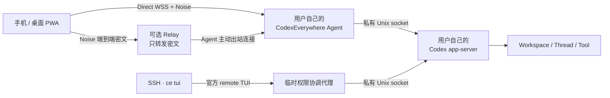
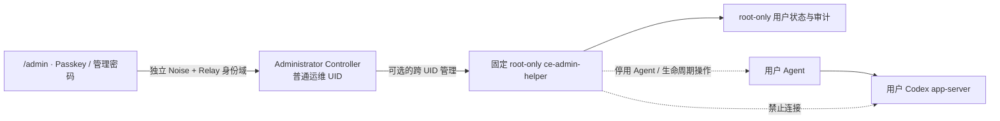

<p align="center">
  
</p>

<h1 align="center">CodexEverywhere</h1>

<p align="center">
  <strong>在任意浏览器中，安全地继续运行在 Linux / HPC 上的 Codex。</strong>
</p>

<p align="center">
  <a href="#当前状态">Alpha</a> ·
  <a href="#核心能力">Web / PWA</a> ·
  <a href="#架构">Direct + E2EE Relay</a> ·
  <a href="#从源码开始">Node.js 20</a> ·
  <a href="docs/architecture.zh-CN.md">架构文档</a> ·
  <a href="CONTRIBUTING.md">参与贡献</a> ·
  <a href="LICENSE">Apache-2.0</a>
</p>

CodexEverywhere 是一个面向 Linux/HPC 和可信小团队的自托管 Codex Web/PWA 控制平台。它让用户能够从手机或桌面浏览器查看会话、发送消息、处理审批、管理工作区，并在 Web 与官方 Codex TUI 之间无中断接力。

项目不重新实现 Codex Agent。thread、turn、工具调用、审批和执行状态仍以官方 [Codex app-server](https://developers.openai.com/codex/app-server) 为唯一事实源；CodexEverywhere 只提供安全连接、Web 体验、持久队列和 HPC 运行层。

> [!WARNING]
> 项目目前处于 Alpha 阶段，最新预发布版本为 `v0.3.0-alpha.5`，尚未发布稳定版本。GitHub Release 提供经过 CI 验证的 Web、Agent、Relay 和 HPC 部署工具制品；协议、配置和存储结构仍可能变化，现阶段建议用于个人环境或可信团队试用。

> [!NOTE]
> 这是一个独立的非官方项目，与 OpenAI 没有关联或背书。Codex 是 OpenAI 的产品。

## 为什么需要 CodexEverywhere

Codex CLI 很适合终端，但 HPC 用户经常还需要：

- 离开 SSH 后继续查看正在运行的任务；
- 在手机上处理审批、补充消息或查看结果；
- 从 Web 切换到 TUI，再切回 Web，而不打断当前 turn；
- 让每位课题组成员使用自己的 Linux 账号和 ChatGPT/Codex 账号；
- 在无法开放 HPC 入站端口时，通过不可信公网服务器转发端到端密文；
- 保留 HPC 原有的目录权限、共享文件系统、tmux、crontab 和调度习惯。

CodexEverywhere 的目标不是提供 Web Terminal，也不是替代 SSH、Slurm 或 Codex CLI，而是为 Codex 增加一个随时可访问的安全控制面。

## 核心能力

- **真实 Codex 会话**：创建、恢复和实时查看 app-server thread；以安全 Markdown 和 KaTeX 显示回复中的标题、列表、表格、代码与 LaTeX 公式，并结构化呈现计划、命令、文件修改、MCP、subagent、审批和错误。每条时间线消息显示自动更新的相对时间，悬停可查看本地精确时间。桌面端根据用户消息生成可收起的右侧大纲，窄屏通过侧滑面板快速定位；实时回复只在用户停留于底部时自动跟随，向上阅读历史后可通过“回到最新消息”恢复跟随。乐观发送、实时流和后台快照按 turn 与 item 身份归并，不会把同一条用户消息或首次回复重复显示。打开长会话时默认只读取最近 20 个 turn，用户可按需向前分页；后台和结果未知的发送对账只读取有界的近期 turn，收起的命令输出与文件差异按需生成 DOM，避免历史持续增长拖慢页面。旧版 Codex 不支持分页协议时，打开会话会回退完整历史；结果对账可以在当前页面内缓存一次成功的完整快照，但缓存只用于按 `clientUserMessageId` 正向确认，绝不与后续轮次的 Queue 快照拼成“未找到”证据。Queue 的负向对账必须在同一轮先成功读取 `queue/list`，再成功读取一份新的完整 `thread/read`；每个 client/operation 的完整读取总计最多 3 次或 30 秒，Queue 当轮缺失时的成功读取也计入上限，失败或退避期间只能用缓存做正向确认。耗尽后停止专用结果核对调度和自动 mutation replay，转入显式人工核对；正常会话同步仍可按 operation ID 正向收口，但不会因这项待确认状态继续读取完整历史或盲目重发。`turn/start`、`queue/add` 的 operation key、待确认状态和快照缓存都只存在于当前已加载页面的内存中，不持久化提示词等业务数据；手动刷新会丢失这些状态，因此存在待确认发送时离开或刷新页面会触发浏览器提示。只有 `thread/start` 另有不含业务内容的跨刷新 opaque 标记。
- **Codex 斜杠指令**：输入 `/` 即可按当前 Web 适配清单搜索、键盘或触控补全内置指令和别名；Web 等价操作调用 app-server 或现有界面，TUI/平台限定操作给出明确说明，未知指令不会被误发给模型。CLI 更新新增的指令会随 CodexEverywhere 的适配更新进入清单，但不影响更新版 CLI 的其他能力运行。
- **Web / TUI 无缝接力**：会话页以高对比入口和可永久隐藏的说明条展示 SSH 接力；Web、后台 Queue 和经 `ce tui` 临时代理启动的官方 TUI 连接同一个 app-server，切换客户端不会中断活动任务，也不会用新客户端的启动默认值覆盖会话创建时保存的权限。直接绕过 `ce tui` 连接原始 app-server socket 的 remote TUI 不参与权限 coordination，不提供这项一致性保证。
- **Queue 优先**：thread 忙碌时消息默认进入宿主机持久 Queue；输入框上方固定显示待发送数量、消息正文与暂停、正在提交或结果待核对状态，不会被实时回复刷入历史。同一 thread 仅队首且尚未开始投递的消息可在活动 turn 结束前转为 Steer，尚未投递的消息可安全移除。新版 Agent 从入队事务开始就把兼容 Queue 行物理保存为 `done`，只在旧 Agent 会忽略的 additive 表中维护 pending / paused / running；因此回滚旧 Agent 可以正常启动，但看不到也无法投递新版消息。`turn/start` / `turn/steer` 副作用前，Agent 再同事务写入不含 prompt 的永久消费 claim 并删除逻辑排队状态；此后断连、权限保存或 claim 完成失败一律进入“结果待核对”，禁止自动重放并阻断同 thread 后续项。若结果未知标记因瞬时存储错误未能落盘，Agent 只在后台重试该标记并指数退避，绝不重跑 app-server 请求；关闭时停止重试，下一次启动继续保守收敛。用户只能在核对 app-server 权威历史后显式确认放弃这条记录，确认后才恢复后续 Queue。当前任务的停止操作也与发送按钮放在同一输入区域。
- **审批收件箱**：命令、文件、权限审批和 `requestUserInput` 固定显示在输入框上方，不随实时回复滚走。多个请求按 `requestId` 独立排队，一次只展开当前项，处理成功后自动推进；不提供容易误授权的“全部允许”。其他 Web/TUI 客户端先处理时，本页同步显示结果。审批期间 Queue 压缩为可展开的单行摘要。
- **多工作区管理**：登记允许的 workspace root、浏览子目录、筛选历史会话；范围包含多个子目录时，会话按实际工作目录折叠分组。创建会话时可选择模型、推理强度、sandbox 和审批策略。
- **会话级权限与全局默认值**：对话页常驻显示 sandbox 与审批策略；统一设置中心允许用户把新会话默认 sandbox 和审批策略保存在自己的宿主机状态库中，换设备后仍保持一致。新建会话会明确显示并带入这些默认值，但已有会话继续使用 app-server 保存的自身权限，只有用户在 Web 或经 `ce tui` 代理的 TUI 中明确修改才会更新。
- **多用户 Unix 隔离**：每个 Linux 用户拥有独立 Agent、app-server、`~/.codex`、Web 身份、工作区、会话和队列。
- **自助初始化**：管理员完成一次公共安装后，符合 HPC SSH/NSS 策略的现有用户可运行 `ce device pair` 自行初始化。
- **专用部署账号**：共享发行版、Node/tmux 运行时和自助初始化服务由无特权 `codexeverywhere` 账号持有；日常发布、回滚和用户首次初始化不需要 root。
- **最小管理员控制面**：独立的 `/admin` 页面通过管理员 Passkey 或 OPAQUE 专用密码登录，可精确登记现有 Unix 用户、停用/启用 Web、签发短时恢复交接码、安排 24 小时后移除并查看安全审计；管理员不能查看用户工作区、会话、文件或 Codex 凭据。跨 UID 强制停止或删除仍属于可选的宿主机特权能力。
- **Codex 安装、更新与登录引导**：接受当前账号中任何可运行的 Codex 版本；版本设置会分别显示当前安装版本和 npm 最新稳定版，并明确提示是否存在可用更新。用户可把最新版安装到自己的 `~/.local`，更新后自行决定何时重启 app-server，并可使用官方设备码或经 E2EE 导入已有的 `~/.codex/auth.json`。
- **Passkey 与专用密码**：Web 身份由 Codex 宿主机验证；CodexEverywhere 不收集、复用或验证 SSH 密码。专用密码默认临时登录，只有显式保存新设备时才需要设备名称；当前浏览器已有同一用户记录时沿用原名称。
- **Direct 优先、Relay 回退**：浏览器可直连时使用 HTTPS/WSS Direct Gateway；不可达时通过可选无状态 Relay 转发 Noise 端到端密文。
- **窗口生命周期内持续在线**：Direct、Relay control 和 Relay tunnel 每 15 秒发送心跳，连续 4 个周期无响应才清理半开连接；单个 RPC 到期只表示结果未知，不会杀死仍健康的 transport，普通用户与管理员页面都会保留该 client 并在下一周期复查。只要页面没有关闭，网络切换、浏览器休眠或代理回收 WebSocket 后都会以最高 30 秒的间隔无限重连，并使用仅存于页面与 Agent 进程内存、绑定 Noise 设备密钥的恢复票据静默恢复 Passkey 或密码会话；同一设备的多个窗口各有独立票据。刷新/关闭页面或 Agent 重启会丢失票据，凭据恢复和可信设备撤销会主动使相应票据失效，此时才回到正常交互认证；后台页面不会弹出 WebAuthn，可见后至多自动尝试一次，取消或失败便停在显式登录界面。可能已经执行的消息、审批或配置变更使用原幂等键核对权威状态，绝不盲目重复提交；`thread/start`、`turn/start` 与 `queue/add` 在副作用前都会永久保存不含 prompt 或文件内容的安全操作身份与 durable claim。claim 发布后，handler 拒绝、app-server 断连、返回内容不可验证或 durable result 自身提交失败都统一返回不可判定并禁止同 key 重放；`thread/start` 可永久保存不含 prompt 的已验证创建结果，而 `turn/start` 与 `queue/add` 的完整响应只返回给当前内存中的首次调用及其并发等待者，Host 永久记录与旧 Agent 兼容镜像始终只保存不可判定 tombstone，后续靠 `clientUserMessageId` 权威对账。Web 不会按 cwd、时间或消息文本误认结果，也不会自动换新 key 重放；从发起创建到结果明确或用户显式放弃期间，同一标签页的 `sessionStorage` 只保存固定版本的 opaque “待核对”标记，不含消息、目录、操作编号、身份或 Host Profile，并在离开页面前提示。刷新后新建入口仍会先要求用户核对会话列表并显式放弃，新的创建才会使用新的操作编号；浏览器拒绝存储时页面不会崩溃，当前页面仍保持内存中的待确认约束。
- **Relay 同路由续签**：公共安装为每个内核认证的 Unix UID 保存私有的随机 route 绑定；普通 Agent 与 Administrator Controller 都会在 provisioned capability 到期前 30 天开始无限次重试自助续签，重试间隔按剩余寿命限制为最多 12 小时、1 小时或 5 分钟，并按随机 route 做确定性抖动以避免批量重启形成请求风暴。管理员续签还必须同时匹配 root 登记的 Controller UID/NSS 元组、admin handle 与 route，Controller 始终拿不到 provisioner credential。新 capability 原子落盘后只轮换 Relay control，并原地延长 route 授权而不关闭已有 tunnel，浏览器 SavedHost 不变；注册帧一旦发出，即使确认帧丢失也继续用新 capability 重连，旧 capability 的延迟重连不能把新截止时间回滚。普通 Agent 的 capability、transport、Passkey origin 与 Codex 网络代理配置都在同一跨进程协调锁内重新读取并按字段合并，续签不会覆盖用户刚保存的网络设置。宿主机 provisioner credential 仍必须由 Relay 运维者在自身到期前轮换，这一有效期是部署授权安全边界，不是 Web 页面会话 TTL；若运维者让绝对授权真正到期，Relay 会关闭该 route 的 control、pending 与 active tunnel，页面保持无限重试并在重新授权后恢复。
- **适配老旧 HPC**：首个目标环境是 CentOS 7、glibc 2.17、Node.js 20；用户服务兼容 tmux、crontab watchdog、PID 文件和文件锁。
- **响应式 PWA**：支持桌面与移动端布局、浅色/深色模式、可安装应用外壳和临时设备模式。应用更新会预缓存构建清单中的完整 hash 资源图，并保留仍被旧标签页使用的版本缓存；因此其他标签页可以先保留草稿或一次性凭据，之后再显式安全刷新，期间仍能加载该版本尚未使用过的密码等延迟模块。
- **统一设置中心**：右上角集中管理外观、新会话默认权限、工作目录、Codex 网络与版本，以及 Passkey、专用密码和恢复码，避免全局设置散落在页面各处。

## 当前状态

| 能力                                      | 状态             |
| ----------------------------------------- | ---------------- |
| Codex 安装、设备码登录与 `auth.json` 导入 | 可用             |
| thread 创建、恢复、流式事件与审批         | 可用             |
| 持久 Queue、Queue → Steer、Interrupt      | 可用             |
| Workspace 管理与受限目录浏览              | 可用             |
| Direct Gateway 与无状态 E2EE Relay        | 可用             |
| Passkey、OPAQUE 专用密码与恢复码          | 可用             |
| Web / `ce tui` 官方 TUI 接力              | 可用             |
| 多用户公共安装与 SSH 用户自助初始化       | 可用，仍属 Alpha |
| 斜杠指令补全、重命名、归档和删除          | 可用             |
| 文件上传、下载与完整 diff 浏览            | 计划中           |
| Schedule、Web Push 与加密离线会话         | 计划中           |
| 宿主机管理员停用、移除与恢复控制面        | 可用，仍属 Alpha |

运行时不锁定 Codex CLI 版本：Agent 会接受任何能够正常执行并返回语义版本号的 Codex。仓库仍保留一个已验证版本生成的 app-server TypeScript schema 作为编译基线，并将未知事件作为 generic event 处理；用户升级到更新版本不需要等待 CodexEverywhere 发版。CodexEverywhere 自身升级时仍应刷新 schema 与兼容测试，以尽快支持新增的结构化能力。

## 架构



每位 Linux 用户只运行一个长期 app-server，由它承载多个 workspace 和 thread。Agent 在 spawn 前先原子发布带宿主机 boot identity 的启动保留记录，再原子发布 app-server 的不可变进程身份并删除该保留记录；因此 Agent 即使在 spawn 与 PID 发布之间崩溃，后继也会在同一 boot 内失败关闭而不会启动第二实例。带匹配 app-server owner record 的保留记录可以按同一 nonce 安全清理；没有匹配 owner record 的残留只有在能够证明来自旧 boot 时才自动回收，同一 boot 内则必须先由运维者确认没有启动中的 child，再按错误提示移除。Agent 可以同时配置 Direct 与 Relay：

- **Direct**：浏览器能够到达宿主机时的首选路径。Nginx 只暴露 Agent Gateway，app-server socket 永不暴露到公网。
- **Relay**：适合 NAT、防火墙或 HPC 入站受限环境。Relay 不保存用户数据库，只在内存中维护在线 opaque route 和有限期授权的防回滚高水位，并转发端到端密文；这些易失状态在进程重启时全部清空。
- **Local/TUI**：SSH 用户通过 `ce tui` 进入同一个 app-server；Web 或 TUI 退出不会停止正在运行的 turn。

Gateway 按 Noise 帧序严格解密并为大消息分片；会改变状态的请求按客户端顺序执行，而 `thread/list`、`thread/read` 等只读请求独立并发。这样既保留 `thread/start` 后紧接 `turn/start` 的顺序，也避免慢速历史读取阻塞发送、审批或中断操作。普通变更的成功/失败结果保留 24 小时；`thread/start`、`turn/start` 与 `queue/add` 使用独立且不自动过期的 durable mutation claim，并向旧版 Agent 的幂等表同步永久兼容镜像。安全指纹只包含方法以及必要时的 `threadId`/`clientUserMessageId`，不对 prompt、输入或文件内容做可离线猜测的永久哈希。`thread/start` 只有非空 `thread.id` 才能保存成功结果；`turn/start` 要求非空 `turn.id`，`queue/add` 还必须验证返回的 thread、operation ID 与请求一致，但二者即使成功也只在 durable tombstone 提交后向首次内存调用返回完整响应，永久表与兼容镜像不复制内容型响应。claim 发布后的 handler 拒绝、断连、异常响应或结果提交失败一律收敛为 `IDEMPOTENCY_OUTCOME_INDETERMINATE`；短期未发布的旧 `thread_start_claims` 表升级时会安全迁移并物理清除旧整包 payload 哈希。由此升级或回滚后的旧 Agent 对相同幂等键也会拒绝自动重放。新版 Web 会按 `clientUserMessageId` 对账或要求人工核对；若同时回滚到不识别该结构化错误的旧 Web，用户仍可能手动以新键再次提交。Host Queue 后台消费另以稳定 queue item ID 作为一次性边界：新版从入队起让兼容行始终保持物理 `done`，把 pending / paused / running 放在 additive `queue_item_states`；正常 dispatch、fallback drain 与 Steer 在调用 app-server 前共用一份不含内容或内容哈希的永久 claim，并原子删除逻辑状态。当前版本从 claim 合成 `delivering` / `indeterminate`；结果标记的瞬时落盘失败只触发 item 去重、单计时器和有上限指数退避的后台状态修复，不会再次调用 app-server，Agent 关闭后则由下次启动接管遗留 NULL claim。每次打开状态库也会把任何物理非 `done` 行视为回滚期间由旧 Agent 创建或恢复的不可证明结果，隔离为待人工核对。由此 new → old → new 后也不会重放，而正常新版 pending 项跨重启继续保留。

Gateway 没有面向已打开页面的 idle 或 absolute 会话 TTL。心跳只负责识别真正的半开 socket，网络故障后的逻辑会话由页面内存票据恢复；Web 的请求 deadline 与 Noise 分片的 idle/absolute deadline 只约束单次请求或未完成消息，不是页面连接寿命。

更完整的协议、身份、生命周期和威胁边界见[架构与产品规格](docs/architecture.zh-CN.md)。

管理员控制面与用户数据面是两条隔离路径：



## 安全与隔离

CodexEverywhere 将四种身份明确分开：

1. **CodexEverywhere Web 身份**：Passkey 或独立专用密码；
2. **Linux 身份**：HPC 已有的 SSH/Unix 用户和文件权限；
3. **ChatGPT/Codex 身份**：每位用户自己的 Codex 登录和额度。
4. **宿主机管理员 Web 身份**：独立管理员 Passkey 或 OPAQUE 管理密码；不复用 SSH 密码，也不能登录普通用户数据面。

关键安全边界：

- 不创建 Linux 用户，不读取 `/etc/shadow`，不收集 SSH 密码；
- 每位用户的 Codex 凭据只保存在自己的 `~/.codex`；
- Relay 不持久化用户名、Passkey、密码记录、恢复码、workspace、thread 或文件；
- Direct 与 Relay 都使用应用层 Noise 端到端加密，不只依赖 TLS；
- 专用密码使用 OPAQUE PAKE，Agent 只保存 registration record；
- 页面恢复票据为 256-bit 随机值，只在浏览器页面内存出现；Agent 仅在进程内保存带域分隔的 SHA-256 摘要，并绑定 principal、node、user、device ID、Noise 静态公钥及记住/临时设备域。恢复码替换凭据会撤销全部票据和活动 Web 身份，撤销可信设备只撤销该设备的 remembered 延续；
- 恢复码、页面票据、OPAQUE 响应和设备登录码等敏感认证结果不进入 24 小时 SQLite 幂等表；为了处理响应丢失，同一 transport 仅在有界内存中按请求指纹保留最多 128 个原响应、最长 5 分钟，连接关闭或到期即清除；未认证连接中的 WebAuthn challenge、恢复授权和 OPAQUE 登录中间态同样一次性使用、5 分钟主动过期，不能借“窗口持续在线”无限保留；
- 管理员 Controller 使用与普通用户不同的 Relay route、Noise user ID、Passkey user handle、OPAQUE user identifier、状态库和浏览器 Host Profile；同名也不会串路由；
- 共享发布与首次初始化不使用 root；可选 root helper 只接受固定管理员运行账号通过无参数 sudo 入口提交的版本化跨 UID 操作，不提供 shell、任意路径或任意用户名执行参数；变更使用 revision 防并发覆盖并写入 root-only 审计；
- workspace 路径在执行前经过 `realpath`、root 包含关系和符号链接逃逸检查；
- 日志禁止记录提示词、文件内容、凭据、恢复码、配对秘密和解密后的 Relay payload；
- `auth.json` 等同于登录凭据，只能由用户本人显式导入，并经已认证 E2EE 通道写入自己的账号。
- 生产 CSP 只为 KaTeX 动态排版放行内联 `style` 属性；脚本、`<style>` 元素和其他资源仍受原有同源策略限制，避免为公式渲染整体放宽 CSP。

E2EE 不能消除 Web 代码分发风险：如果 PWA 静态服务器被完全攻陷并向新访问者发送恶意 JavaScript，浏览器仍可能受到攻击。生产部署应保护静态资源发布链路、TLS 私钥和宿主机管理员权限。

发现安全问题时，请不要在公开 Issue 中粘贴凭据、日志中的敏感内容或可用的攻击细节。报告方式与支持范围见[安全策略](SECURITY.md)。

## 环境要求

### 开发环境

- Node.js `>= 20.20.0`
- Corepack 与 pnpm `10.34.5`
- macOS 或 Linux

### Codex 宿主机

- 已有的 Linux/SSH 用户；CodexEverywhere 不负责创建系统账号
- Node.js 20；CentOS 7 可使用专用部署账号所有的共享 conda runtime
- `tmux` 和 `crontab`，不要求用户级 systemd
- 用于 Passkey 的稳定 HTTPS PWA Origin
- Direct 模式需要可信 TLS 入口；否则使用可选 Relay

宿主机用户不必预先安装或登录 Codex。Agent 会优先检测 `~/.local/bin/codex`，再检测 Agent `PATH` 中的 Codex；任何能正常报告版本的安装都可使用。共享 watchdog 和 Codex 子进程环境会加入 Agent 自身的 Node.js 运行目录，因此从最小 cron 环境启动时也能执行基于 `#!/usr/bin/env node` 的用户级 Codex。PWA 可以把 npm 最新稳定版安装或更新到用户自己的 `~/.local`，不需要 root，也不会修改其他位置或共享安装。

## 从源码开始

源码 checkout 只用于开发、测试和生成 Release，不是生产配置目录。公开仓库中的域名、账号、路径和代理均为虚构示例；真实配置保存在对应服务器的受限目录，HPC、Web 与 Relay 通过 GitHub Release 升级，不在生产机 `git pull` 或重新构建。配置归属、备份和回滚边界见[部署与升级](docs/deployment.zh-CN.md)。

### 1. 安装依赖并构建

```bash
corepack enable
pnpm install --frozen-lockfile
pnpm typecheck
pnpm test
pnpm build
```

生产部署前建议同时运行真实 app-server 集成测试：

```bash
pnpm test:app-server
```

### 2. 初始化单用户 Agent

以下命令适合从源码验证单用户部署。将示例域名和目录替换为自己的环境：

```bash
node apps/agent/dist/cli.js agent init
node apps/agent/dist/cli.js workspace add /absolute/path/to/project
node apps/agent/dist/cli.js auth configure https://codex.example.com
```

配置至少一种传输。

Direct 模式：

```bash
node apps/agent/dist/cli.js transport direct \
  wss://hpc.example.com/gateway \
  --listen-host 127.0.0.1 \
  --listen-port 7345
```

Relay 模式：

```bash
node apps/agent/dist/cli.js transport relay \
  wss://relay.example.com/relay \
  --capability-stdin
```

Direct 与 Relay 可以同时存在；PWA 会先尝试 Direct，失败后再回退 Relay。

### 3. 启动、诊断和配对

```bash
node apps/agent/dist/cli.js doctor
node apps/agent/dist/cli.js agent start
node apps/agent/dist/cli.js device pair
```

将 `apps/web/dist` 部署到前面配置的 HTTPS Origin。然后打开 PWA，把 `device pair` 输出的配对 JSON 粘贴到“首次初始化”页面，注册第一个 Passkey，并妥善保存只显示一次的恢复码。

稳定运行时可安装用户级 tmux/crontab watchdog：

```bash
node apps/agent/dist/cli.js agent install-service
```

Nginx 示例：

- [公共 PWA + Relay](deploy/nginx/codex-everywhere.conf)
- [Direct Gateway + 可选自托管 PWA](deploy/nginx/direct-host.conf)

## 多用户 HPC 部署

推荐创建一个无 sudo 权限的专用账号 `codexeverywhere`。它只持有共享运行时、版本化 Agent 和 rootless provisioner；每个 Agent、app-server、Codex 凭据和业务数据仍始终以对应用户自己的 UID 运行。root 只需最后一次把固定 launcher 安装为 `/usr/local/bin/ce`，此后的发布、回滚和首次初始化均不需要 root。

默认安装在该账号 home 下时，安装脚本会把 home 设为 `0711`，只允许其他用户穿越到已知的共享程序路径而不能列出 home；`.ssh`、provisioner credential 等私有目录仍保持 `0700`，私有文件保持 `0600`。

从源码构建 Agent bundle 仅用于开发、测试或尚无正式 Release 的首次 bootstrap：

```bash
deploy/hpc/prepare-agent-bundle.sh /tmp/codex-everywhere-agent
```

以 `codexeverywhere` 登录 HPC，创建该账号所有的 Node.js/tmux runtime，并原子安装版本化 Agent：

```bash
deploy/hpc/create-rootless-runtime.sh /path/to/conda
deploy/hpc/install-rootless-agent.sh \
  /tmp/codex-everywhere-agent \
  <release-id>
```

Relay 管理员为整台宿主机签发一次 provisioner credential：

```bash
ce-relay issue-provisioner \
  --installation-id <installation-id> \
  --expires-days 365
```

Relay 服务本身也必须用同一个 installation ID 启动，例如 `ce-relay serve --installation-id <installation-id> --host 127.0.0.1 --port 7346 --trust-loopback-proxy`。一个 Relay 进程只服务一个 installation；需要接入另一台独立宿主机时使用隔离的 Relay 实例和入口。升级既有部署时，先把 systemd 示例中的 `__INSTALLATION_ID__` 替换为 provisioner credential 内的 ID 再重启；占位符未替换会使进程拒绝启动。已有 v3/v4 capability 的随机 route ID 不变且继续有效，无需重新配对或改写浏览器 Host Profile。

通过安全通道把 credential 直接写入专用账号的标准输入。credential 不应进入命令参数、shell 历史、发布包或普通日志：

```bash
ce provisioner install \
  --origin https://codex.example.com \
  --relay-endpoint wss://relay.example.com/relay \
  --default-codex-proxy http://proxy.example.com:8080 \
  --credential-stdin

ce provisioner install-service
```

`ce provisioner status` 会显示宿主机 credential 的到期时间。运维者应在到期前至少 30 天重新执行 `ce-relay issue-provisioner`，并用相同的 installation ID 再次执行 `ce provisioner install ... --credential-stdin`；不需要也不允许普通用户取得 credential。rootless provisioner 以请求文件的内核 owner UID 和 NSS tuple 绑定首次随机 route，此后只为该绑定续签，不接受用户提交任意 route ID。安装新 credential 时，仍有效的旧 credential 只暂存到其原到期时间，用于对升级前已有 capability 做一次完整验签并迁入 route registry；过期材料会由 provisioner 删除，不能用于延长授权。Agent 从到期前 30 天开始无限次自动重试：剩余超过 7 天时至多间隔 12 小时，剩余 1–7 天时至多 1 小时，最后 1 天及过期后至多 5 分钟；每档按随机 route 施加稳定抖动，批量升级或重启不会让所有用户同相位请求。成功后 route ID 和 SavedHost 不改变。

首次升级到支持续签的版本时，应先重启 rootless provisioner，再滚动重启用户 Agent，并在旧 credential/capability 到期前完成；新版客户端会检查 provisioner descriptor feature，遇到仍在运行的旧服务时失败关闭，而不会误领一个新 route。已经越过旧 credential 到期时间且尚未建立 route binding 的历史用户不能自助证明旧 route，需要 Relay 运维者走显式 route 恢复流程；这是防止伪造 victim route 的安全阻断边界。

`--default-codex-proxy` 是可选的部署级默认值，适合宿主机提供本地代理的集群。它只在用户尚未选择 Codex 网络时写入首次初始化配置，不覆盖已有用户设置；用户之后仍可在 Web 的“Codex 网络”中切换。不要通过该命令行参数传递含用户名或密码的代理 URL；需要私密代理凭据时，应由用户在 E2EE Web 设置中自行配置。

此后，符合现有 SSH 和 NSS 策略的普通用户可以直接执行：

```bash
ce device pair
```

rootless provisioner 的请求目录使用 sticky + write-only 权限。请求文件的所有者 UID 由内核提供，服务再通过 NSS 校验该 UID 的用户名、home 与登录 shell；请求与响应使用临时 Noise 密钥加密并绑定 request ID，用户不能替其他 UID 初始化，也不能读取别人的 grant。

最后一次 root 操作只安装一个固定、拒绝以 UID 0 执行专用账号代码的 launcher：

```bash
deploy/hpc/install-rootless-global-shim.sh \
  /public/home/codexeverywhere/software/codex-everywhere \
  codexeverywhere
```

正式 Release 后，升级不再从开发工作区上传 bundle。专用账号下载 Release 中经过校验的 `codex-everywhere-hpc-tools-<tag>.tar.gz`，解压后执行：

```bash
hpc-tools/install-release.sh <tag>
```

该入口会下载同一 Release 的 Agent、manifest 和 SHA-256，并要求通过 GitHub CLI 把 provenance attestation 绑定到本仓库的 Release workflow、请求的 tag ref 和 manifest commit，或显式传入 staging 已批准的 manifest SHA-256。验证版本、协议、Node.js、制品哈希和 bundle 构建信息后，安装器为目录、文件、符号链接及其内容生成完整 inventory，再原子切换唯一的 `current` 指针；重复安装和回滚都会重新核对这份 inventory。生产回滚只接受这种 `verified` 目录；源码开发安装记录为 `development`，必须显式传入 runtime 和 `--allow-development` 才能切回，旧版无 inventory 目录不会被静默补证。旧的 root-owned shared installer 和 sudo self-provision helper 仅作为迁移兼容路径保留。完整权限模型见[架构文档](docs/architecture.zh-CN.md#多用户公共安装)，生产发布边界见[部署与升级](docs/deployment.zh-CN.md)。

### 安装管理员控制面

选择一个已有且受信任的本地运维 Unix 账号运行 Administrator Controller。这个账号会被授予调用固定管理 helper 的能力，因此应按宿主机管理员账号保护：

```bash
# root shell；依赖前一步已经安装的 host provisioner
ce admin install-controller <ops-unix-user> --handle <admin-handle>

# 切换到命令输出中指定的 Controller 运行账号
CE_ADMIN_HOME=/var/lib/codex-everywhere/admin-controller \
  ce admin web pair
```

打开 `https://<PWA-origin>/admin`，粘贴配对资料并注册第一个管理员 Passkey。进入“安全设置”后可以设置独立管理员密码；它采用 OPAQUE，不能使用或验证 SSH 密码。Controller 由 `/etc/cron.d/codex-everywhere-admin` 保活，root maintenance 每分钟处理到期的 24 小时移除任务。

Controller 会通过 rootless provisioner 自动续签原 route，并先原子保存新 capability、再原地轮换 Relay control；活动管理员 tunnel、浏览器 SavedHost 和页面内存恢复票据不会因此中断。由旧版本升级时，必须先部署并重启当前 Release 的 rootless provisioner，确认其 descriptor 已声明 `admin-relay-capability-renewal-v1`，再由 root 在当前管理员 capability 到期前重新执行一次同参数的 `ce admin install-controller ...`，最后重启 Controller 并用 `ce admin web status` 核对授权截止和注册状态。这会把 version 2 的 UID/NSS、admin handle 与 route 注册发布给 provisioner；旧 version 1 公共记录仍可供 helper/maintenance 定位 Controller，但续签会失败关闭并在 status 中明确提示迁移。管理员 Controller 不读取或持有 provisioner credential。

管理员操作语义：

- **停用**只停止该用户的 CodexEverywhere Agent 并阻止 watchdog 重启；不会停止 Codex app-server、SSH、官方 TUI 或活动 turn。
- **恢复**生成 10 分钟有效的临时交接码并使旧恢复码失效。用户在普通登录页兑换后，新恢复码只展示给用户，管理员看不到。
- **移除**先停用并等待 24 小时；期间可以取消。到期后仅删除 `~/.codex-everywhere`，保留 `~/.codex`、workspace、Linux 账号和 SSH 权限。
- **重新启用**允许用户继续连接；已经完成移除的用户需要再次运行 `ce device pair` 自助初始化。

## SSH TUI 接力

```bash
# 打开当前工作区的官方会话恢复选择器
ce tui /absolute/path/to/project

# 直接进入 Web 中的同一会话
ce tui /absolute/path/to/project --thread <thread-id>

# 显式创建新会话
ce tui /absolute/path/to/project --new
```

在 TUI 中输入 `/quit` 或 `/exit` 只会关闭当前 TUI 客户端，宿主机上的活动 turn 会继续运行。不要把 `Esc` 当成退出操作；它会中断当前任务。

恢复已有会话时，`ce tui` 会让该 Linux 用户 Host 状态中保存的会话权限优先于 TUI 进程自己的启动默认值；Web、后台 Queue 和所有 `ce tui` 入口通过跨进程持久代次与 per-thread coordination fence 同步审批策略、审批 reviewer 与可恢复的 sandbox 模式，因此 Agent 或 app-server 重启也不会使权限回落。resume 中缺失或为 `null` 的字段都视为继承，未知或缺失字段不会清空其余可恢复值。连接动作和无因果版本的 app-server 广播本身不会改写持久权限；之后在 TUI 使用 `/permissions`，或在 Web 点击对话页的“会话权限”，仍会明确更新该会话后续轮次的默认权限并实时广播给其他已打开客户端。`--new` 创建的新会话则使用 TUI 当次选择的权限，并在 app-server 确认后记录到 Host。

## Monorepo 结构

```text
apps/
├── agent/   # Linux/HPC Agent、CLI、app-server 生命周期和持久 Queue
├── relay/   # 可选的无状态 WebSocket 密文 Relay
└── web/     # TypeScript + Vite Web/PWA

packages/
├── codex-app-server-schema/  # 已验证版本生成的 app-server 编译基线
├── crypto/                   # Noise、配对、加密帧和重放保护
├── protocol/                 # 版本化跨组件协议
└── testing/                  # 测试工具

deploy/
├── hpc/      # 共享 runtime 与 Agent 原子安装脚本
├── nginx/    # PWA、Relay 和 Direct Gateway 示例
└── systemd/  # Relay 服务示例
```

项目使用严格 TypeScript、pnpm workspace、Vite、Vitest、WebAuthn、OPAQUE、Noise 和纯 WASM SQLite。HPC Agent 避免依赖需要新 glibc 的原生 Node 模块。

## 开发与验证

```bash
# Agent + Web 开发模式
pnpm dev

# 格式、类型、单元/协议测试和构建
pnpm format:check
pnpm typecheck
pnpm test
pnpm build

# 需要本机可用的 Codex；用于真实 app-server 兼容测试
pnpm test:app-server
```

提交变更时请同步更新跨组件协议版本和生成类型，并为安全边界、路径处理、重放保护、生命周期或 Queue 行为补充测试。

贡献流程、开发约束和 Pull Request 检查项见[贡献指南](CONTRIBUTING.md)。

## 相关文档

- [完整架构、协议、安全模型与路线图](docs/architecture.zh-CN.md)
- [贡献指南](CONTRIBUTING.md)
- [安全策略](SECURITY.md)
- [版本记录](CHANGELOG.md)
- [发布流程](docs/releasing.zh-CN.md)
- [部署与升级](docs/deployment.zh-CN.md)
- [项目内 Codex/工程约束](AGENTS.md)
- [官方 Codex CLI 文档](https://developers.openai.com/codex/cli)
- [官方 Codex app-server 文档](https://developers.openai.com/codex/app-server)
- [官方 Codex 仓库](https://github.com/openai/codex)

## 路线图

- 完善 thread 行内重命名、归档、恢复、删除菜单，以及 Queue 编辑与排序；
- 完成受限文件浏览、下载和 diff；
- 增加 Schedule、运行历史和 missed-run 策略；
- 增加端到端加密 Web Push 与设备级离线缓存；
- 补充可复现的生产部署、迁移和升级工具；
- 在更多 Linux/HPC 发行版和 Codex 版本上建立兼容矩阵。

## 许可证

CodexEverywhere 采用 [Apache License 2.0](LICENSE)。第三方与生成代码归属见 [NOTICE](NOTICE)。
