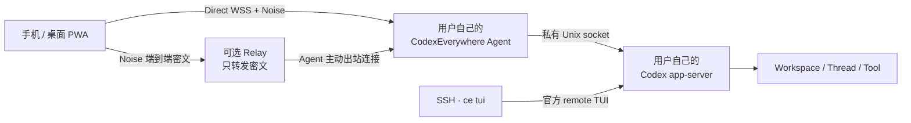
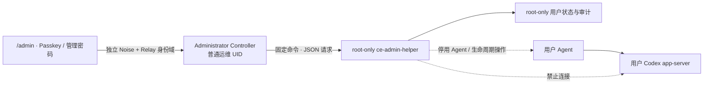

<p align="center">
  
</p>

<h1 align="center">CodexEverywhere</h1>

<p align="center">
  <strong>在任意浏览器中，安全地继续运行在 Linux / HPC 上的 Codex。</strong>
</p>

<p align="center">
  <a href="#当前状态">Alpha</a> ·
  <a href="#核心能力">Web / PWA</a> ·
  <a href="#架构">Direct + E2EE Relay</a> ·
  <a href="#从源码开始">Node.js 20</a> ·
  <a href="docs/architecture.zh-CN.md">架构文档</a> ·
  <a href="CONTRIBUTING.md">参与贡献</a> ·
  <a href="LICENSE">Apache-2.0</a>
</p>

CodexEverywhere 是一个面向 Linux/HPC 和可信小团队的自托管 Codex Web/PWA 控制平台。它让用户能够从手机或桌面浏览器查看会话、发送消息、处理审批、管理工作区，并在 Web 与官方 Codex TUI 之间无中断接力。

项目不重新实现 Codex Agent。thread、turn、工具调用、审批和执行状态仍以官方 [Codex app-server](https://developers.openai.com/codex/app-server) 为唯一事实源；CodexEverywhere 只提供安全连接、Web 体验、持久队列和 HPC 运行层。

> [!WARNING]
> 项目目前处于 Alpha 阶段，首个公开版本为 `v0.3.0-alpha.1`，尚未发布稳定版本或预构建安装包。协议、配置和存储结构可能变化，现阶段建议用于个人环境或可信团队试用。

> [!NOTE]
> 这是一个独立的非官方项目，与 OpenAI 没有关联或背书。Codex 是 OpenAI 的产品。

## 为什么需要 CodexEverywhere

Codex CLI 很适合终端，但 HPC 用户经常还需要：

- 离开 SSH 后继续查看正在运行的任务；
- 在手机上处理审批、补充消息或查看结果；
- 从 Web 切换到 TUI，再切回 Web，而不打断当前 turn；
- 让每位课题组成员使用自己的 Linux 账号和 ChatGPT/Codex 账号；
- 在无法开放 HPC 入站端口时，通过不可信公网服务器转发端到端密文；
- 保留 HPC 原有的目录权限、共享文件系统、tmux、crontab 和调度习惯。

CodexEverywhere 的目标不是提供 Web Terminal，也不是替代 SSH、Slurm 或 Codex CLI，而是为 Codex 增加一个随时可访问的安全控制面。

## 核心能力

- **真实 Codex 会话**：创建、恢复和实时查看 app-server thread；以安全 Markdown 和 KaTeX 显示回复中的标题、列表、表格、代码与 LaTeX 公式，并结构化呈现计划、命令、文件修改、MCP、subagent、审批和错误。桌面端根据用户消息生成常驻右侧大纲，窄屏通过侧滑面板快速定位；实时回复只在用户停留于底部时自动跟随，向上阅读历史后可通过“回到最新消息”恢复跟随。自动历史刷新会合并重复事件并优先读取 Codex 状态库，避免反复扫描全部 JSONL 会话记录。
- **Codex 斜杠指令**：输入 `/` 即可按当前 Web 适配清单搜索、键盘或触控补全内置指令和别名；Web 等价操作调用 app-server 或现有界面，TUI/平台限定操作给出明确说明，未知指令不会被误发给模型。CLI 更新新增的指令会随 CodexEverywhere 的适配更新进入清单，但不影响更新版 CLI 的其他能力运行。
- **Web / TUI 无缝接力**：会话页以高对比入口和可永久隐藏的说明条展示 SSH 接力；Web、`ce tui` 和其他官方 remote TUI 连接同一个 app-server，切换客户端不会中断活动任务，也不会用新客户端的启动默认值覆盖会话创建时保存的权限。
- **Queue 优先**：thread 忙碌时消息默认进入宿主机持久 Queue；每条排队消息可在活动 turn 结束前显式转为 Steer。
- **多工作区管理**：登记允许的 workspace root、浏览子目录、筛选历史会话；范围包含多个子目录时，会话按实际工作目录折叠分组。创建会话时可选择模型、推理强度、sandbox 和审批策略。
- **会话级权限**：对话页常驻显示 sandbox 与审批策略；创建时选择的权限由 app-server 保存并用于后续轮次，只有用户在 Web 或 TUI 中明确修改才会更新，已打开的客户端通过原生设置通知同步显示。
- **多用户 Unix 隔离**：每个 Linux 用户拥有独立 Agent、app-server、`~/.codex`、Web 身份、工作区、会话和队列。
- **自助初始化**：管理员完成一次公共安装后，符合 HPC SSH/NSS 策略的现有用户可运行 `ce device pair` 自行初始化。
- **最小管理员控制面**：独立的 `/admin` 页面通过管理员 Passkey 或 OPAQUE 专用密码登录，可精确登记现有 Unix 用户、停用/启用 Web、签发短时恢复交接码、安排 24 小时后移除并查看安全审计；管理员不能查看用户工作区、会话、文件或 Codex 凭据。
- **Codex 安装、更新与登录引导**：接受当前账号中任何可运行的 Codex 版本；版本设置会分别显示当前安装版本和 npm 最新稳定版，并明确提示是否存在可用更新。用户可把最新版安装到自己的 `~/.local`，更新后自行决定何时重启 app-server，并可使用官方设备码或经 E2EE 导入已有的 `~/.codex/auth.json`。
- **Passkey 与专用密码**：Web 身份由 Codex 宿主机验证；CodexEverywhere 不收集、复用或验证 SSH 密码。专用密码默认临时登录，只有显式保存新设备时才需要设备名称；当前浏览器已有同一用户记录时沿用原名称。
- **Direct 优先、Relay 回退**：浏览器可直连时使用 HTTPS/WSS Direct Gateway；不可达时通过可选无状态 Relay 转发 Noise 端到端密文。
- **适配老旧 HPC**：首个目标环境是 CentOS 7、glibc 2.17、Node.js 20；用户服务兼容 tmux、crontab watchdog、PID 文件和文件锁。
- **响应式 PWA**：支持桌面与移动端布局、浅色/深色模式、可安装应用外壳和临时设备模式。

## 当前状态

| 能力                                      | 状态             |
| ----------------------------------------- | ---------------- |
| Codex 安装、设备码登录与 `auth.json` 导入 | 可用             |
| thread 创建、恢复、流式事件与审批         | 可用             |
| 持久 Queue、Queue → Steer、Interrupt      | 可用             |
| Workspace 管理与受限目录浏览              | 可用             |
| Direct Gateway 与无状态 E2EE Relay        | 可用             |
| Passkey、OPAQUE 专用密码与恢复码          | 可用             |
| Web / 官方 TUI 接力                       | 可用             |
| 多用户公共安装与 SSH 用户自助初始化       | 可用，仍属 Alpha |
| 斜杠指令补全、重命名、归档和删除          | 可用             |
| 文件上传、下载与完整 diff 浏览            | 计划中           |
| Schedule、Web Push 与加密离线会话         | 计划中           |
| 宿主机管理员停用、移除与恢复控制面        | 可用，仍属 Alpha |

运行时不锁定 Codex CLI 版本：Agent 会接受任何能够正常执行并返回语义版本号的 Codex。仓库仍保留一个已验证版本生成的 app-server TypeScript schema 作为编译基线，并将未知事件作为 generic event 处理；用户升级到更新版本不需要等待 CodexEverywhere 发版。CodexEverywhere 自身升级时仍应刷新 schema 与兼容测试，以尽快支持新增的结构化能力。

## 架构



每位 Linux 用户只运行一个长期 app-server，由它承载多个 workspace 和 thread。Agent 可以同时配置 Direct 与 Relay：

- **Direct**：浏览器能够到达宿主机时的首选路径。Nginx 只暴露 Agent Gateway，app-server socket 永不暴露到公网。
- **Relay**：适合 NAT、防火墙或 HPC 入站受限环境。Relay 不保存用户数据库，只在内存中维护在线 opaque route，并转发端到端密文。
- **Local/TUI**：SSH 用户通过 `ce tui` 进入同一个 app-server；Web 或 TUI 退出不会停止正在运行的 turn。

更完整的协议、身份、生命周期和威胁边界见[架构与产品规格](docs/architecture.zh-CN.md)。

管理员控制面与用户数据面是两条隔离路径：



## 安全与隔离

CodexEverywhere 将四种身份明确分开：

1. **CodexEverywhere Web 身份**：Passkey 或独立专用密码；
2. **Linux 身份**：HPC 已有的 SSH/Unix 用户和文件权限；
3. **ChatGPT/Codex 身份**：每位用户自己的 Codex 登录和额度。
4. **宿主机管理员 Web 身份**：独立管理员 Passkey 或 OPAQUE 管理密码；不复用 SSH 密码，也不能登录普通用户数据面。

关键安全边界：

- 不创建 Linux 用户，不读取 `/etc/shadow`，不收集 SSH 密码；
- 每位用户的 Codex 凭据只保存在自己的 `~/.codex`；
- Relay 不持久化用户名、Passkey、密码记录、恢复码、workspace、thread 或文件；
- Direct 与 Relay 都使用应用层 Noise 端到端加密，不只依赖 TLS；
- 专用密码使用 OPAQUE PAKE，Agent 只保存 registration record；
- 管理员 Controller 使用与普通用户不同的 Relay route、Noise user ID、Passkey user handle、OPAQUE user identifier、状态库和浏览器 Host Profile；同名也不会串路由；
- root helper 只接受固定管理员运行账号通过无参数 sudo 入口提交的版本化操作，不提供 shell、任意路径或任意用户名执行参数；变更使用 revision 防并发覆盖并写入 root-only 审计；
- workspace 路径在执行前经过 `realpath`、root 包含关系和符号链接逃逸检查；
- 日志禁止记录提示词、文件内容、凭据、恢复码、配对秘密和解密后的 Relay payload；
- `auth.json` 等同于登录凭据，只能由用户本人显式导入，并经已认证 E2EE 通道写入自己的账号。

E2EE 不能消除 Web 代码分发风险：如果 PWA 静态服务器被完全攻陷并向新访问者发送恶意 JavaScript，浏览器仍可能受到攻击。生产部署应保护静态资源发布链路、TLS 私钥和宿主机管理员权限。

发现安全问题时，请不要在公开 Issue 中粘贴凭据、日志中的敏感内容或可用的攻击细节。报告方式与支持范围见[安全策略](SECURITY.md)。

## 环境要求

### 开发环境

- Node.js `>= 20.20.0`
- Corepack 与 pnpm `10.34.5`
- macOS 或 Linux

### Codex 宿主机

- 已有的 Linux/SSH 用户；CodexEverywhere 不负责创建系统账号
- Node.js 20；CentOS 7 可使用 root 所有的共享 conda runtime
- `tmux` 和 `crontab`，不要求用户级 systemd
- 用于 Passkey 的稳定 HTTPS PWA Origin
- Direct 模式需要可信 TLS 入口；否则使用可选 Relay

宿主机用户不必预先安装或登录 Codex。Agent 会优先检测 `~/.local/bin/codex`，再检测 Agent `PATH` 中的 Codex；任何能正常报告版本的安装都可使用。PWA 可以把 npm 最新稳定版安装或更新到用户自己的 `~/.local`，不需要 root，也不会修改其他位置或共享安装。

## 从源码开始

### 1. 安装依赖并构建

```bash
corepack enable
pnpm install --frozen-lockfile
pnpm typecheck
pnpm test
pnpm build
```

生产部署前建议同时运行真实 app-server 集成测试：

```bash
pnpm test:app-server
```

### 2. 初始化单用户 Agent

以下命令适合从源码验证单用户部署。将示例域名和目录替换为自己的环境：

```bash
node apps/agent/dist/cli.js agent init
node apps/agent/dist/cli.js workspace add /absolute/path/to/project
node apps/agent/dist/cli.js auth configure https://codex.example.com
```

配置至少一种传输。

Direct 模式：

```bash
node apps/agent/dist/cli.js transport direct \
  wss://hpc.example.com/gateway \
  --listen-host 127.0.0.1 \
  --listen-port 7345
```

Relay 模式：

```bash
node apps/agent/dist/cli.js transport relay \
  wss://relay.example.com/relay \
  --capability-stdin
```

Direct 与 Relay 可以同时存在；PWA 会先尝试 Direct，失败后再回退 Relay。

### 3. 启动、诊断和配对

```bash
node apps/agent/dist/cli.js doctor
node apps/agent/dist/cli.js agent start
node apps/agent/dist/cli.js device pair
```

将 `apps/web/dist` 部署到前面配置的 HTTPS Origin。然后打开 PWA，把 `device pair` 输出的配对 JSON 粘贴到“首次初始化”页面，注册第一个 Passkey，并妥善保存只显示一次的恢复码。

稳定运行时可安装用户级 tmux/crontab watchdog：

```bash
node apps/agent/dist/cli.js agent install-service
```

Nginx 示例：

- [公共 PWA + Relay](deploy/nginx/codex-everywhere.conf)
- [Direct Gateway + 可选自托管 PWA](deploy/nginx/direct-host.conf)

## 多用户 HPC 部署

多用户部署中，root 只负责一次公共运行时、共享只读程序和受限 self-provision helper 安装；每个 Agent 和 app-server 始终以对应用户自己的 UID 运行。

构建生产 Agent bundle：

```bash
pnpm --filter @codex-everywhere/agent deploy \
  --prod --legacy /tmp/codex-everywhere-agent
```

在 HPC root shell 中安装共享 Node.js/tmux runtime 和版本化 Agent：

```bash
deploy/hpc/create-shared-runtime.sh /path/to/conda
deploy/hpc/install-shared-agent.sh \
  /tmp/codex-everywhere-agent \
  <release-id>
```

Relay 管理员为整台宿主机签发一次 provisioner credential：

```bash
ce-relay issue-provisioner \
  --installation-id <installation-id> \
  --expires-days 365
```

通过安全通道将 credential 交给 HPC 管理员，并在 root shell 中从不回显的标准输入安装：

```bash
ce admin install-provisioner \
  --origin https://codex.example.com \
  --relay-endpoint wss://relay.example.com/relay \
  --default-codex-proxy http://127.0.0.1:7890 \
  --credential-stdin
```

`--default-codex-proxy` 是可选的部署级默认值，适合宿主机提供本地代理的集群。它只在用户尚未选择 Codex 网络时写入首次初始化配置，不覆盖已有用户设置；用户之后仍可在 Web 的“Codex 网络”中切换。不要通过该命令行参数传递含用户名或密码的代理 URL；需要私密代理凭据时，应由用户在 E2EE Web 设置中自行配置。

此后，符合现有 SSH 和 NSS 策略的普通用户可以直接执行：

```bash
ce device pair
```

helper 不接受目标用户名参数，只依据 sudo 提供的真实调用者身份进行初始化。完整的权限模型、目录布局和发布流程见[架构文档](docs/architecture.zh-CN.md#多用户公共安装)。

### 安装管理员控制面

选择一个已有且受信任的本地运维 Unix 账号运行 Administrator Controller。这个账号会被授予调用固定管理 helper 的能力，因此应按宿主机管理员账号保护：

```bash
# root shell；依赖前一步已经安装的 host provisioner
ce admin install-controller <ops-unix-user> --handle <admin-handle>

# 切换到命令输出中指定的 Controller 运行账号
CE_ADMIN_HOME=/var/lib/codex-everywhere/admin-controller \
  ce admin web pair
```

打开 `https://<PWA-origin>/admin`，粘贴配对资料并注册第一个管理员 Passkey。进入“安全设置”后可以设置独立管理员密码；它采用 OPAQUE，不能使用或验证 SSH 密码。Controller 由 `/etc/cron.d/codex-everywhere-admin` 保活，root maintenance 每分钟处理到期的 24 小时移除任务。

管理员操作语义：

- **停用**只停止该用户的 CodexEverywhere Agent 并阻止 watchdog 重启；不会停止 Codex app-server、SSH、官方 TUI 或活动 turn。
- **恢复**生成 10 分钟有效的临时交接码并使旧恢复码失效。用户在普通登录页兑换后，新恢复码只展示给用户，管理员看不到。
- **移除**先停用并等待 24 小时；期间可以取消。到期后仅删除 `~/.codex-everywhere`，保留 `~/.codex`、workspace、Linux 账号和 SSH 权限。
- **重新启用**允许用户继续连接；已经完成移除的用户需要再次运行 `ce device pair` 自助初始化。

## SSH TUI 接力

```bash
# 打开当前工作区的官方会话恢复选择器
ce tui /absolute/path/to/project

# 直接进入 Web 中的同一会话
ce tui /absolute/path/to/project --thread <thread-id>

# 显式创建新会话
ce tui /absolute/path/to/project --new
```

在 TUI 中输入 `/quit` 或 `/exit` 只会关闭当前 TUI 客户端，宿主机上的活动 turn 会继续运行。不要把 `Esc` 当成退出操作；它会中断当前任务。

恢复已有会话时，`ce tui` 会让 app-server 中已经保存的会话权限优先于 TUI 进程自己的启动默认值。连接动作本身不会改权限；之后在 TUI 使用 `/permissions`，或在 Web 点击对话页的“会话权限”，仍会明确更新该会话后续轮次的默认权限，并同步到其他已打开客户端。`--new` 创建的新会话则使用 TUI 当次选择的权限。

## Monorepo 结构

```text
apps/
├── agent/   # Linux/HPC Agent、CLI、app-server 生命周期和持久 Queue
├── relay/   # 可选的无状态 WebSocket 密文 Relay
└── web/     # TypeScript + Vite Web/PWA

packages/
├── codex-app-server-schema/  # 已验证版本生成的 app-server 编译基线
├── crypto/                   # Noise、配对、加密帧和重放保护
├── protocol/                 # 版本化跨组件协议
└── testing/                  # 测试工具

deploy/
├── hpc/      # 共享 runtime 与 Agent 原子安装脚本
├── nginx/    # PWA、Relay 和 Direct Gateway 示例
└── systemd/  # Relay 服务示例
```

项目使用严格 TypeScript、pnpm workspace、Vite、Vitest、WebAuthn、OPAQUE、Noise 和纯 WASM SQLite。HPC Agent 避免依赖需要新 glibc 的原生 Node 模块。

## 开发与验证

```bash
# Agent + Web 开发模式
pnpm dev

# 格式、类型、单元/协议测试和构建
pnpm format:check
pnpm typecheck
pnpm test
pnpm build

# 需要本机可用的 Codex；用于真实 app-server 兼容测试
pnpm test:app-server
```

提交变更时请同步更新跨组件协议版本和生成类型，并为安全边界、路径处理、重放保护、生命周期或 Queue 行为补充测试。

贡献流程、开发约束和 Pull Request 检查项见[贡献指南](CONTRIBUTING.md)。

## 相关文档

- [完整架构、协议、安全模型与路线图](docs/architecture.zh-CN.md)
- [贡献指南](CONTRIBUTING.md)
- [安全策略](SECURITY.md)
- [版本记录](CHANGELOG.md)
- [发布流程](docs/releasing.zh-CN.md)
- [项目内 Codex/工程约束](AGENTS.md)
- [官方 Codex CLI 文档](https://developers.openai.com/codex/cli)
- [官方 Codex app-server 文档](https://developers.openai.com/codex/app-server)
- [官方 Codex 仓库](https://github.com/openai/codex)

## 路线图

- 完成 thread 重命名、归档和删除；
- 完成受限文件浏览、下载和 diff；
- 增加 Schedule、运行历史和 missed-run 策略；
- 增加端到端加密 Web Push 与设备级离线缓存；
- 补充可复现的生产部署、迁移和升级工具；
- 在更多 Linux/HPC 发行版和 Codex 版本上建立兼容矩阵。

## 许可证

CodexEverywhere 采用 [Apache License 2.0](LICENSE)。第三方与生成代码归属见 [NOTICE](NOTICE)。
