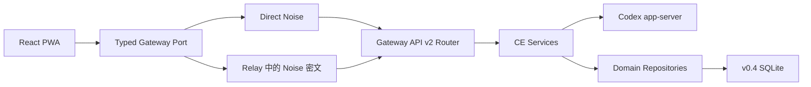

<p align="center">
  
</p>

<h1 align="center">CodexEverywhere</h1>

<p align="center">
  <strong>在手机或桌面浏览器中，安全地继续运行在 Linux / HPC 上的 Codex。</strong><br />
  <sub>Self-hosted Codex Web/PWA for Linux and HPC.</sub>
</p>

<p align="center">
  <a href="https://github.com/JunpoYu/CodexEverywhere/actions/workflows/ci.yml"></a>
  <a href="https://github.com/JunpoYu/CodexEverywhere/releases"></a>
  <a href="LICENSE"></a>
  
</p>

CodexEverywhere（CE）是面向 Linux/HPC 的自托管 Codex Web/PWA 控制平台。它让用户离开 SSH 后，仍能查看任务、发送消息、处理审批、管理 Queue，并在 Web 与官方 Codex TUI 之间继续同一个任务。

CE 不重新实现 AgentLoop。thread、turn、工具活动、审批请求和执行状态始终以官方 [Codex app-server](https://developers.openai.com/codex/app-server) 为唯一事实源；CE 只负责安全连接、Web 身份、移动端产品体验、持久 Queue 和 HPC 生命周期。

> [!WARNING]
> 当前代码线为 `v0.4.0-alpha.3` 架构重建版。Gateway API v2 和新状态库不兼容 v0.3；v0.4 采用全新初始化，不迁移 v0.3 CE 状态。`~/.codex`、Codex 登录和 app-server 任务不属于清理范围。`v0.3.0-alpha.14` 是已完成实机验证的最后维护基线，只用于观察窗内恢复已保留的旧 CE 目录。v0.4 Alpha tag/Prerelease 冻结待验收制品；同一制品必须先完成多用户全新安装 staging，才能批准 production 部署。

> [!NOTE]
> 这是独立的非官方开源项目，与 OpenAI 没有关联或背书。Codex 是 OpenAI 的产品。

## v0.4 的核心边界

- 每位 Unix 用户运行一个长期 CE Agent 和一个长期 Codex app-server；不同用户的 UID、home、`~/.codex`、状态库和业务数据相互隔离。
- Passkey 与 CE 专用密码由 Codex 宿主机验证，不收集或验证 SSH/Linux 密码；每位用户使用自己的 ChatGPT/Codex 账号完成官方设备码登录。
- Direct 优先；无法开放入站连接时，可选 Relay 只转发 Noise 端到端密文，不保存或解密 Gateway payload。
- 管理端只管理一次性宿主机安装、现有 NSS 用户的启停、移除计划和 Web 凭据恢复，不能读取用户任务、文件、Queue 或 Codex 身份。
- 不提供 Web Terminal、第二套 HPC 调度器、第三方插件加载器、Side 临时支线或浏览器 `auth.json` 上传。
- Schedule、Push 和完整文件管理不属于 v0.4 首版。

## 核心体验

### 任务与实时交互

- 在 UI 中把 app-server `thread` 称为“任务”，协议和代码继续使用 `thread`。
- 创建、打开、分页、重命名、归档、恢复和删除任务；按稳定 item/turn ID 合并权威历史与实时状态。
- 结构化呈现消息、计划、命令、文件修改、MCP、subagent、错误和未知的 generic event。
- 审批、用户问题和 MCP elicitation 固定显示在 composer 上方；多个设备同时回答时只接受第一个合法响应。
- 可中断 turn，也可复制 `ce tui` 接力命令；关闭浏览器不会停止活动 turn。

### 断线恢复与副作用安全

- 断线后重新认证或使用仅驻当前页面内存的恢复票据，然后重新 `thread/open` 获取权威快照和未解决 interaction。
- mutation 使用 UUID operation key。durable mutation 在宿主机记录 claim/result；Web 通过 `mutation/status` 对账 `missing | pending | completed | indeterminate`，不靠历史猜测自动重发。
- 一次性恢复码、恢复交接码和 resume token 永不进入 durable receipt；只在 Agent 的有界内存窗口中允许同 operation key 重放。
- Queue 使用持久 claim 和 at-most-once 边界；跨越 app-server 副作用窗口后无法证明结果时显式进入 `indeterminate`，必须由用户确认重试或放弃。

### 身份、初始化和临时模式

- 首次配对后可注册 Passkey；也可设置与 SSH 完全独立的 OPAQUE CE 密码。
- 新设备可使用 Passkey、CE 密码或恢复码登录，不依赖 HPC CLI、旧设备批准或设备白名单。
- PWA 内可配置直连/代理、安装或更新用户自己的 Codex、执行官方设备码登录、退出 Codex 账号和安全重启 app-server。
- 临时模式不把 Host Profile、设备私钥、会话票据或业务缓存写入 IndexedDB/localStorage。
- 恢复码只展示一次，宿主机只保存哈希；轮换会使旧码全部失效。

## 架构



v0.4 借鉴通用 Harness 的 service seam、scope、registry 和事件驱动思想，但保持轻量且静态装配：

- `ServiceRegistry`：类型化 token，重复注册和缺失依赖立即失败；
- `Scope`：统一拥有子作用域、AbortSignal、timer、listener 和异步 disposer；
- `TypedEventBus<EventMap>`：只传递 CE 控制面的瞬时事件；
- `Actor<State, Event, Effect>`：纯 reducer 产生 effect，旧 generation 的异步结果不能覆盖新状态；
- Agent 使用单一 composition root；Web 在身份边界只装配互斥的 User 或 Admin composition root，管理端不会实例化任务、Workspace 或 Queue actor。所有模块均为静态装配，不扫描目录、不动态执行第三方代码。

Noise handshake 与 Relay wire protocol 保持 version 1；加密后的 Gateway API 为 version 2；自定义 payload 内部为 `version: 1`。Host Profile、设备密钥和 pairing document 格式不变，因此升级不要求重新配对。新旧 Web/Agent 不匹配时明确返回升级错误，不静默降级。

完整服务边界、方法表、Actor、数据库和安全约束见 [v0.4 架构](docs/architecture.zh-CN.md)。
冻结的 P0/P1、探索性场景和合成协议样本见 [v0.4 回归基线](docs/v0.4-bug-baseline.zh-CN.md)。

## 快速开始

### 开发环境

要求：macOS 或 Linux、Node.js `>=20.20.0`、Corepack 和 pnpm `10.34.5`。

```bash
git clone https://github.com/JunpoYu/CodexEverywhere.git
cd CodexEverywhere
corepack enable
pnpm install --frozen-lockfile
pnpm check:architecture
pnpm typecheck
pnpm test
pnpm build
pnpm check:web-budget
```

初始化一个新用户 Agent：

```bash
node apps/agent/dist/cli.js agent init
node apps/agent/dist/cli.js workspace add /absolute/path/to/project
node apps/agent/dist/cli.js auth configure https://codex.example.com
node apps/agent/dist/cli.js transport direct wss://codex.example.com/gateway
node apps/agent/dist/cli.js agent start
node apps/agent/dist/cli.js device pair
```

将 `apps/web/dist` 部署到配置的 HTTPS Origin，打开 PWA，粘贴 `ce device pair` 输出的一次性资料并注册首个 Passkey。恢复码必须立即离线保存。

生产环境不要在服务器上 `git pull` 或临时构建；只部署经过校验的不可变 Release 制品。多用户 HPC、Relay、rootless provisioner 和管理员控制面的架构边界见[部署与升级](docs/deployment.zh-CN.md)；交给其他 Agent 执行时，使用带输入清单、停止条件和验收输出的[部署、升级与回滚操作手册](docs/operator-runbook.zh-CN.md)。

## 从 v0.3 全新切换

v0.4 不提供状态迁移 CLI。切换时先停止旧 Agent（保持健康 app-server），将完整的 `~/.codex-everywhere` 改名保留，并在任何 v0.4 用户配对前隔离宿主 provisioner 的旧 admin 状态库，再启用 v0.4 并重新配对。Passkey、CE 密码、恢复码、Workspace、偏好和 Queue 会重建；provisioner credential/密钥、`~/.codex`、Codex 登录与 app-server 任务保留。

旧 CE 目录在观察窗内只读保留，不导入新库。若切换失败，只能停止 v0.4、将新目录留存、原子恢复旧目录并切回 alpha.14；不合并两份状态。详见 [v0.4 全新初始化与切换手册](docs/migration-v0.4.zh-CN.md)。

## Web / TUI 接力

```bash
# 打开当前工作区的官方恢复选择器
ce tui /absolute/path/to/project

# 直接进入 Web 中的同一任务
ce tui /absolute/path/to/project --thread <thread-id>

# 显式创建新任务
ce tui /absolute/path/to/project --new
```

`ce tui` 与 Web 连接同一个 app-server。直接使用原始 `codex --remote` 会绕过 CE 的权限协调；需要一致性保证时使用 `ce tui`。

## 安全模型

关键边界包括：

- Direct 与 Relay 都使用应用层 Noise E2EE；
- OPAQUE 密码、Passkey、恢复哈希和设备信任保存在对应 Unix 用户的 0600 状态库；
- workspace 路径先 `realpath`，再校验授权 root，拒绝路径穿越和符号链接逃逸；
- repository 之外禁止直接访问 SQLite；用户库和管理员库使用不同 `application_id`；
- 日志禁止记录提示词、Queue 文本、文件内容、路径内容、凭据、恢复码和已解密 Relay payload；
- PWA 静态分发仍是信任边界：被攻陷的 Web 服务器可以向新访问者发送恶意 JavaScript，E2EE 不能消除这一风险。

请通过 GitHub Private Vulnerability Reporting 报告安全问题，不要在公开 Issue 中粘贴敏感日志。

## 当前范围

| 能力                                          | v0.4 状态  |
| --------------------------------------------- | ---------- |
| React PWA、移动/桌面响应式 Shell              | 已实现     |
| Passkey、CE 密码、恢复码与临时登录            | 已实现     |
| Codex 安装、更新和设备码登录                  | 已实现     |
| 任务、历史分页、流式事件、审批和中断          | 已实现     |
| Queue、Steer、结果未知保护                    | 已实现     |
| Workspace、任务设置和 TUI 接力                | 已实现     |
| Direct、无状态 E2EE Relay、多用户管理员控制面 | 已实现     |
| v0.4 全新初始化、旧 CE 目录隔离与观察窗恢复   | 已实现     |
| Schedule、Push、完整文件管理、通用插件        | 不进入首版 |
| Side、`thread/fork`、浏览器 `auth.json` 导入  | 已移除     |

## Monorepo

```text
apps/
├── agent/   # Linux/HPC Agent、CLI、app-server 生命周期和 Queue
├── relay/   # 可选无状态 WebSocket 密文 Relay
└── web/     # React + React Router + CSS Modules PWA

packages/
├── kernel/                   # Registry、Scope、EventBus、Actor
├── protocol/                 # Gateway API v2 与 transport/Relay v1
├── codex-app-server-schema/  # app-server 编译基线
├── crypto/                   # Noise、配对、加密帧和重放保护
└── testing/                  # 测试工具
```

技术栈：严格 TypeScript、Zod、React、Vite、Vitest、WebAuthn、OPAQUE、Noise 和纯 WASM SQLite。首个兼容目标为 CentOS 7、Node.js 20 和 glibc 2.17；Agent 不新增依赖新 glibc 的原生运行库。

## 开发门禁

```bash
pnpm format:check
pnpm check:architecture
pnpm check:test-runtime
pnpm typecheck
pnpm test
pnpm build

# 需要本机已有可用 Codex；模型调用仍由显式环境开关控制
pnpm test:app-server
```

干净候选提交可使用 `pnpm verify:v0.4 -- --receipt <仓库外路径>` 一次运行完整门禁并生成只含版本、commit、状态和耗时的 0600 receipt。添加 `--with-model` 才会启用真实订阅模型调用；未启用时 receipt 会明确保留该外部门槛。多用户升级与回滚见 [v0.4 staging 验收手册](docs/staging-v0.4.zh-CN.md)。

协议、安全、路径、生命周期、数据库或 Queue 变更必须同步测试和中文文档。贡献流程见 [CONTRIBUTING.md](CONTRIBUTING.md)，发布流程见[发布文档](docs/releasing.zh-CN.md)，版本变化见 [CHANGELOG.md](CHANGELOG.md)。

## 许可证

CodexEverywhere 使用 [Apache License 2.0](LICENSE)。第三方与生成代码归属见 [NOTICE](NOTICE)。
