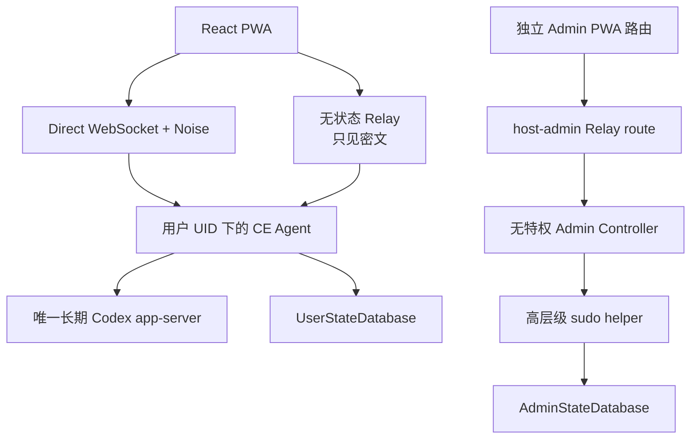
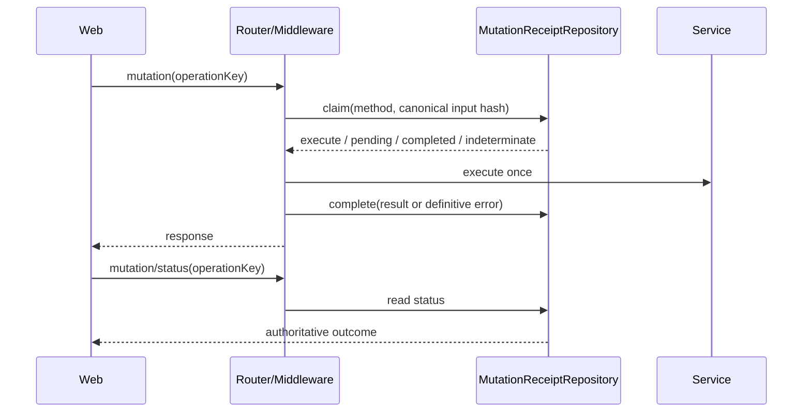

# CodexEverywhere v0.4 架构与产品规格

本文档是 v0.4 的架构事实源。协议字段、schema 和标识符使用英文；产品界面把 app-server `thread` 称为“任务”。

## 1. 目标与非目标

CE 的目标是在 Linux/HPC 上提供最短路径的 Codex Web/PWA 控制面，并保留现有 Unix、SSH、文件系统和 Codex 安全边界。

必须保持：

- Codex app-server 是 thread、turn、工具、审批和执行状态的唯一事实源；
- 每位 Unix 用户运行一个 Agent 和一个长期 app-server；
- 用户各自持有 `~/.codex` 和 ChatGPT/Codex 身份；
- Direct 和无状态 E2EE Relay 均可使用，Direct 不依赖 Relay；
- Web/TUI/Queue 可同时引用同一任务，设备切换不停止活动 turn；
- CentOS 7、Node.js 20、glibc 2.17、tmux/crontab watchdog 可运行。

明确不做：

- 第二套 AgentLoop、组织治理、计费、资源配额或复杂 RBAC；
- Web Terminal 或第二套 HPC 调度器；
- Cordis 或第三方插件加载器；
- Side 临时支线、`thread/fork`、浏览器 `auth.json` 上传；
- v0.4 首版的 Schedule、Push 和完整文件管理。

## 2. 系统拓扑



Relay wire protocol 和 Noise transport handshake 继续使用 version 1。业务明文只存在于浏览器和目标 Agent 的 Noise 会话内；Relay 不拥有 Gateway Router、用户数据库或解密密钥。

## 3. 轻量内核

`packages/kernel` 只提供四项通用能力：

### 3.1 ServiceRegistry

- 使用类型化 token 注册和读取服务；
- 重复注册、seal 后写入、缺失服务立即抛错；
- 模块由 composition root 显式装配，不扫描目录或动态加载用户代码。

### 3.2 Scope

- 每个 scope 拥有 AbortSignal、子 scope、timer、listener 和 disposer；
- `close()` 幂等，按注册逆序异步释放；
- disposer 聚合失败，但继续释放其余资源；
- Agent 的 app-server client、Gateway session、lease、循环和 Web actor effect 都必须有明确 scope owner。

### 3.3 TypedEventBus

- 事件名和 payload 由 `EventMap` 在编译期约束；
- 只用于控制面瞬时事件，不持久化 app-server 会话状态；
- 订阅取消由所属 scope 管理。

### 3.4 Actor

- reducer 是纯函数，只返回新状态和 effect；
- 会启动、替换或终止异步工作的事件递增 generation，并取消上一代 effect scope；
- reducer 可将不产生 effect 的输入、通知等纯状态事件显式标记为 `preserveEffects`，避免误取消当前工作；
- 旧 generation 的异步结果不能 dispatch 到新状态；
- React 通过 `useSyncExternalStore` 订阅，不使用 Redux 或 XState。

## 4. Gateway API v2

`packages/protocol/src/v2` 是 Agent 与 Web 的共享契约。Zod schema 是运行时边界，TypeScript input/output 从 schema 推导。

每个方法必须声明：

| 字段          | 取值                           | 语义                               |
| ------------- | ------------------------------ | ---------------------------------- |
| `access`      | `pre-auth \| user \| admin`    | Router 统一鉴权                    |
| `kind`        | `query \| mutation`            | query 禁止 operation key           |
| `idempotency` | `none \| ephemeral \| durable` | mutation 必须有 UUID operation key |
| `capability`  | 可选字符串                     | 握手协商后才开放特性               |

Router 在 handler 前依次完成 envelope 版本、方法、input schema、当前设备/票据、access、capability 和 operation key 校验；handler output 也必须通过 schema。未知方法、错误身份域或缺少 mutation key 均失败关闭。

### 4.1 方法组

- `host/*`：连通性和 Gateway 版本；
- `auth/*`：Passkey、OPAQUE 密码、恢复码、状态和轮换；
- `setup/*`：网络、Codex 安装/版本、设备码登录、退出、app-server 重启；
- `workspace/*`：授权 root、浏览、增删和默认项；
- `thread/*`：列表、打开、历史、创建、关闭、命名、归档、删除、设置和 TUI handoff；
- `turn/*`：发送与中断；
- `interaction/*`：审批、用户问题和 MCP elicitation；
- `queue/*`：全局/任务列表、添加、移除、Steer 和 indeterminate 确认；
- `preferences/*`：用户偏好；
- `mutation/status`：durable mutation 权威对账；
- `admin/*`：宿主状态、NSS 精确检查、登记、启停、移除、恢复交接和审计。

v2 registry 永久排除 `thread/fork`、全部 `side/*` 和 `setup/codex/auth/import`。

### 4.2 版本协商

- Noise handshake：version 1；
- Relay wire protocol：version 1；
- 加密 Gateway envelope：version 2；
- CE 自有 payload：内部 `version: 1`；
- Host Profile、pairing document 和设备密钥：现有 version 1 格式。

Agent 不接受 v1 业务 envelope，返回 `CLIENT_UPGRADE_REQUIRED`；v2 Web 连接旧 Agent 时显示 `AGENT_UPGRADE_REQUIRED`。不允许静默降级。PWA Service Worker 等待用户确认，并在一次性秘密、草稿或 outcome-unknown mutation 存在时阻止刷新。

### 4.3 Codex 事件

已知 app-server notification 使用由固定 schema 基线生成的校验器。未知 notification 包装为：

```ts
type CodexGenericEvent = {
  version: 1;
  method: string;
  params: JsonValue;
};
```

未知事件必须向前兼容地传到任务时间线，不能导致 Agent 崩溃或静默丢弃。

## 5. Agent 服务

用户 Agent composition root 装配：

| 服务                 | 职责                                                        |
| -------------------- | ----------------------------------------------------------- |
| `IdentityService`    | Passkey、密码、恢复码、设备信任、临时会话                   |
| `SetupService`       | 网络、用户级 Codex 安装、设备码登录、版本和 app-server 运维 |
| `WorkspaceService`   | realpath、root 授权、浏览和 revision                        |
| `CodexSupervisor`    | 唯一 app-server 的串行 ensure/inspect/restart               |
| `CodexClientFactory` | 按 scope 创建独立 JSON-RPC client                           |
| `ThreadLeaseManager` | 每任务一个共享 lease，管理 viewer/Queue 引用                |
| `InteractionBroker`  | 当前 client 上未解决的 app-server server request            |
| `QueueService`       | repository、dispatcher、Steer、crash window 和结果未知      |
| `PreferencesService` | 用户默认设置和 revision                                     |
| `AdminService`       | 独立管理员领域，不导入用户业务服务                          |

Direct/Relay adapter 只处理连接、Noise 帧和事件转发；业务校验与 dispatch 进入同一个 Gateway v2 Router。

### 5.1 Thread lease

同一 Agent 中每个 thread 最多一个 lease，可被多个浏览器 viewer 和 Queue dispatcher 引用。lease 拥有：

- 独立 app-server client；
- notification/server-request 订阅；
- `InteractionBroker`；
- 当前 turn、thread 状态与 workspace path；
- viewer/Queue 引用计数和子 scope。

浏览器断线立即释放 viewer；活动 turn、待处理 interaction 或 Queue 引用继续保留 lease。无引用且 idle 时立即关闭。最多保留 128 个 lease，达到上限时拒绝创建，不驱逐活动任务。

`thread/open` 总是返回 app-server 权威快照、历史边界、当前状态、thread settings 和未解决 interaction。多个设备回答同一 interaction 时，broker 原子取出待处理项，第一个合法回答成功，其余设备收到 `interaction/resolved` 或明确失败。

Agent/app-server 重启后不恢复旧 server-request callback；旧 interaction 显示失败。thread 本身通过 app-server 重新打开。

### 5.2 Mutation

durable mutation 流程：



request fingerprint 是完整、已验证 input 的 canonical SHA-256；数据库不保存 prompt、路径、Queue 文本或凭据。相同 key 与不同 input 必须返回 `OPERATION_KEY_REUSED`。进程启动时残留 `pending` claim 转为 `indeterminate`，禁止自动重放。

包含恢复码、handoff code 或 resume token 的方法只能使用有界内存 `ephemeral` 重放；协议测试和 middleware metadata 校验共同阻止它们进入 SQLite。

### 5.3 Queue

Queue item 和 delivery claim 在同一用户库中。dispatcher 在 app-server 副作用前写入 claim；确定完成后记录 turn ID。若崩溃发生在外部副作用边界，恢复为 `indeterminate`，不重新调用 app-server。该状态会阻塞同任务后续派发，直到用户显式选择 retry 或 dismiss。

## 6. 身份与隔离

四类身份互不替代：

1. Unix/SSH 身份：由现有 NSS 和 SSH 策略决定；
2. CE Web 身份：Passkey 或 CE 专用 OPAQUE 密码；
3. Codex 身份：用户自己的官方设备码登录和 `~/.codex`；
4. 宿主机管理员 Web 身份：独立数据库、route、Passkey/密码和 principal。

设备密钥只证明 Noise 端点持有对应私钥；Router 每次已认证请求仍重新验证设备未撤销。临时会话只使用当前页面内存里的设备密钥和 resume ticket，Web 不写 IndexedDB/localStorage 业务状态。

管理员只能对精确 NSS 用户执行登记、禁用、启用、移除计划和恢复交接。恢复交接码只返回给当前管理员页面一次，数据库保存哈希并记录不含秘密的审计事件。管理员 composition root 不能导入 thread、workspace、Queue 或用户 repository。

## 7. React PWA

依赖边界：React、React DOM、React Router、内核 Actor、CSS Modules、原生语义控件和 `<dialog>`。不使用 Redux、XState、Tailwind 或大型 UI 框架。

主要 actor：

| Actor      | 关键状态                                                                         |
| ---------- | -------------------------------------------------------------------------------- |
| Connection | disconnected、connecting、authenticating、online、reconnecting、upgrade-required |
| Onboarding | inspect、network、install、codex-login、ready                                    |
| TaskList   | loading、ready、paginating、failed                                               |
| Thread     | closed、opening、syncing、idle、running、waiting-input、reconnecting、failed     |
| Composer   | idle、submitting、outcome-unknown、reconciling、manual-review                    |
| Queue      | loading、ready、mutating、indeterminate                                          |
| Admin      | signed-out、authenticating、ready、mutating                                      |

路由：`/hosts`、`/setup`、`/tasks`、`/tasks/:threadId`、`/queue`、`/workspaces`、`/settings`、`/admin/*`。未完成 onboarding 时 user route gate 强制进入 `/setup`。

桌面使用左侧导航/任务列表、中间任务内容和按需操作区；390px 移动端使用任务、Queue、工作区、设置四项底部导航。Markdown、KaTeX 和代码呈现只在任务页懒加载，并继续经 DOMPurify 清洗。

`GatewayPort` 是 React 唯一远端边界。顶层身份边界只创建一个 runtime：普通用户进入 `UserWebRuntime`，管理员进入 `AdminWebRuntime`。两者使用独立 context、actor 和路由；Admin runtime 不导入或实例化 thread、workspace、Queue 等用户业务 actor。`ReconnectingGatewayPort` 热切换 Direct/Relay transport，actor 和组件不会持有 WebSocket。恢复后用户 runtime 重新读取 onboarding、任务、Queue、当前 `thread/open`，并对账 composer operation key。

## 8. 状态数据库

用户和管理员库从 `user_version = 1` 开始，并使用不同 `application_id`：

- `UserStateDatabase`：metadata、workspace、preferences、thread permissions、identity、mutation receipts、Queue、最小安全审计；
- `AdminStateDatabase`：管理员 identity、managed users、admin audit 和 admin mutation receipts。

repository 之外禁止 import `sql.js`。状态文件继续使用跨进程锁、真实 UID、0600、文件 fsync、目录 durability 和原子 rename。`StateSnapshotV1` 只是 repository 内部的类型化数据形状，不对外提供 v0.3 转换或 JSON 导出。密码记录、恢复哈希和 Queue 内容不进入日志。

v0.3 切换采用整目录隔离和全新初始化，不导入旧数据库。规则见[全新初始化与切换手册](migration-v0.4.zh-CN.md)。

## 9. 日志与敏感数据

禁止记录：

- prompt、回复、Queue 文本和文件内容；
- workspace/path 内容；
- Passkey、OPAQUE 消息、Codex 凭据、设备私钥；
- pairing secret、恢复码、handoff code、resume ticket；
- 已解密 Relay payload 或完整 Gateway input/output。

允许记录有限的结构化控制字段，例如固定事件名、协议错误码、耗时、计数和不含业务内容的随机 request ID。错误向浏览器返回稳定 code 和去敏 message。

## 10. 工程门禁

`pnpm check:architecture` 检查：

- v0.4 source graph 无循环依赖；
- kernel 不依赖其他 CE package；
- React v4 不导入旧 monolith、Agent 或 SQL；
- v2 非 repository 不直接 import `sql.js`；
- raw Gateway envelope 只存在于 gateway adapter；
- v2/v4 活跃源码不出现 Side、`thread/fork` 或 `auth/import` 方法。

发布前必须通过 format、architecture、typecheck、unit/protocol、build、Direct/Relay integration 和真实 app-server contract。模型调用测试使用显式环境开关。用户路由初始 JS gzip 上限 250 KiB，CSS gzip 上限 40 KiB；Markdown/KaTeX 必须保持独立懒加载。
